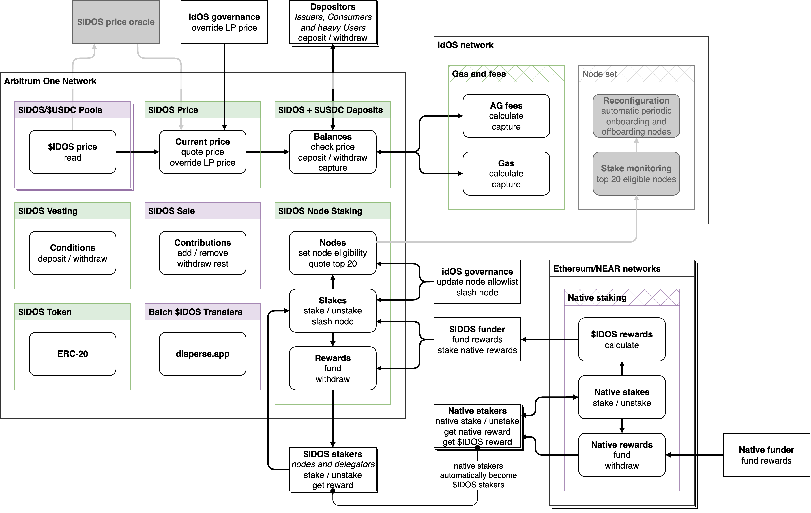

# Contracts

- `pnpm i`
- `pnpm hardhat compile` (required to generate types)
- `pnpm hardhat test`
- `npx tsc --noEmit` to type check

See also gas experiments here: https://github.com/idos-network/node-staking-gas-tests

