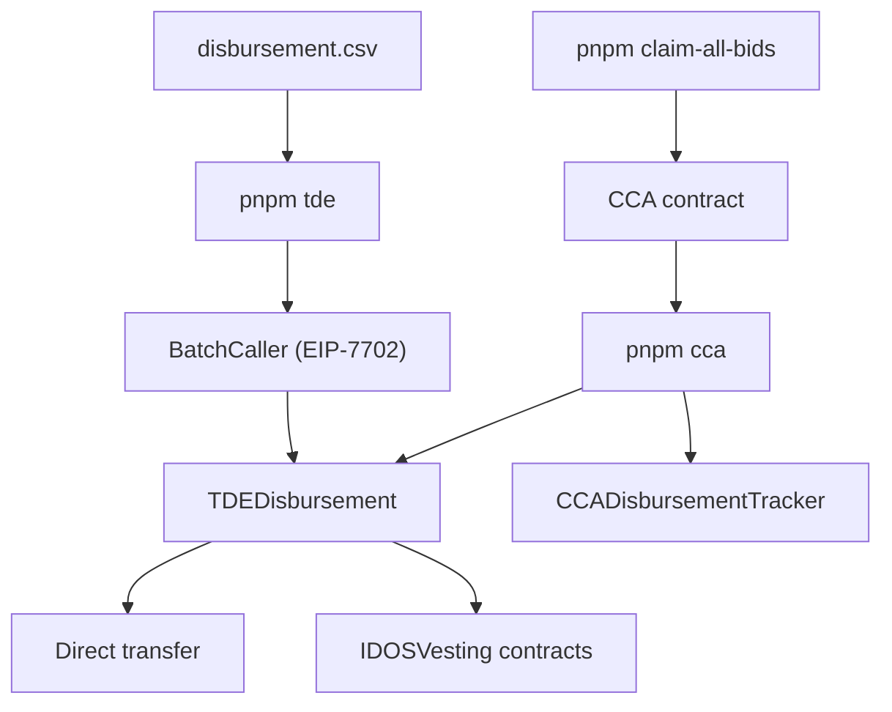

# Initial Distribution

## Note well

There are post-scriptums to this script. There are a few details that we only
caught after deploying TDEDisbursement.sol that require manual intervention. See
the end of this README for more details on those.

## Overview

TypeScript tooling that drives the IDOS token initial distribution using the
on-chain `TDEDisbursement` contract. There are two main flows:

- **TDE** -- CSV-based disbursement of token allocations (pre-sale, team,
  ecosystem, etc.).
- **CCA** -- Disbursement of tokens purchased through a Continuous Clearing
  Auction.

Both flows funnel through the same `TDEDisbursement` contract, making it the
single source of truth for all distribution activity. `TDEDisbursement` has a
main function, `disburse(beneficiary, amount, modality)`. Modalities are what
identifies the type of distribution:

- If the modality is `DIRECT`, then the tokens will be transferred directly to
  the beneficiary.
- If the modality is `VESTED_1_6`, then the tokens will be put in a
  `IDOSVesting` contract with a 1 month cliff and lasts for 6 months.
- There are more modalities. Check `modalities.ts` and/or `TDEDisbursement.sol`
  for the full list.

## Contracts

These scripts interact with several on-chain contracts:

- **IDOSToken** -- The ERC-20 token being distributed.
- **TDEDisbursement** -- Central disbursement contract. Both TDE and CCA flows
  call `disburse(beneficiary, amount, modality)` on it. Depending on the
  modality, it either transfers tokens directly or creates and funds an
  `IDOSVesting` contract.
- **IDOSVesting** -- Per-beneficiary, per-modality vesting wallet (OpenZeppelin
  `VestingWallet` with a cliff). Created automatically by `TDEDisbursement` on
  first disburse for a given beneficiary+modality pair.
- **ContinuousClearingAuction (CCA)** -- The auction contract (external to this
  repo). Scripts read its events to determine filled bids. Note that this
  contract doesn't distribute $IDOS tokens directly, it uses $rIDOS (a
  `CCADisbursementTracker`) to enable multiple distribution modalities (whale
  vs. normal phases) from a single auction.
- **CCADisbursementTracker** -- Bookkeeping contract for the CCA flow. It
  bridges the gap between what the CCA thinks should be disbursed and what's
  actually disbursed by our scripts. It has a
  `recordDisbursement(beneficiary, amount, txHash)` function that records the
  disbursement on-chain for clear traceability of bonuses and vesting splits.
- **BatchCaller** -- Plumbing. EIP-7702 delegation target that lets the
  disburser EOA execute multiple `disburse` calls in a single transaction. Used
  only by the TDE flow. CCA flow uses `TDEDisbursement.disburse()` directly and
  records each disbursement on `CCADisbursementTracker` for clear traceability.

## Architecture



The TDE flow reads `disbursement.csv`, determines which rows haven't been
disbursed yet (by comparing against on-chain `Disbursed` events), and sends the
remaining ones through `BatchCaller` for gas-efficient batched execution.

The CCA flow reads auction events from the CCA contract, computes the expected
disbursement entries (whale vs. normal phase, bonuses, vesting splits), and
calls `TDEDisbursement.disburse()` directly -- one transaction per entry. It
additionally records each disbursement on `CCADisbursementTracker` for clear
traceability and idempotency.

Before running the CCA flow, `pnpm claim-all-bids` must be run to exit all bids
and claim tokens for all CCA bids.

## Source files

### Entrypoints

| File              | Description                                                                                                                                            |
| ----------------- | ------------------------------------------------------------------------------------------------------------------------------------------------------ |
| `tde.ts`          | Main TDE disbursement script. Loads the CSV, fetches on-chain logs, finds pending rows, and disburses via `BatchCaller`.                               |
| `cca.ts`          | CCA disbursement script. Fetches auction events, computes expected entries, reconciles with `CCADisbursementTracker`, and disburses remaining entries. |
| `claimAllBids.ts` | Exits all bids and claims tokens for all CCA bids. Prerequisite for `cca.ts`.                                                                          |

### Domain logic

| File                     | Description                                                                                                                             |
| ------------------------ | --------------------------------------------------------------------------------------------------------------------------------------- |
| `csv.ts`                 | Parses `disbursement.csv` into typed rows.                                                                                              |
| `findPendingRows.ts`     | Compares CSV rows against on-chain `Disbursed` logs and returns rows not yet disbursed.                                                 |
| `computeDisbursement.ts` | Splits CCA amounts into whale/normal phases, applies the 20% whale bonus, and splits whale allocations into 1/6 immediate + 5/6 vested. |
| `ccaEntries.ts`          | Builds expected CCA disbursement entries from filled bids, the phase boundary, and the sweep.                                           |
| `modalities.ts`          | Maps CSV modality names to the on-chain enum and defines vesting schedules (start, cliff, end).                                         |

### Infrastructure

| File            | Description                                                                                                                    |
| --------------- | ------------------------------------------------------------------------------------------------------------------------------ |
| `tdeSetup.ts`   | TDE environment setup: chain config, wallet clients, token allowance, and batch disburse orchestration.                        |
| `batch.ts`      | EIP-7702 batch execution: delegates to `BatchCaller`, groups `disburse` calls into gas-sized batches.                          |
| `chains.ts`     | Resolves chain config by ID (Arbitrum One, Arbitrum Sepolia, Sepolia), creates viem clients and wallet clients (`makeWallet`). |
| `abis.ts`       | Contract ABIs, validated against Forge build artifacts at import time.                                                         |
| `abiChecker.ts` | Checks that hardcoded ABIs in `abis.ts` match current Forge artifacts.                                                         |
| `lib.ts`        | Shared utilities: `requireEnv`, `paginatedGetEvents`, `blockWindows`, `findFirstBlockAtOrAfter`, etc.                          |

## Setup

**Prerequisites:** Node >= 24, pnpm.

```bash
pnpm install
cp .env.example .env
```

## Usage

### TDE disbursement

```bash
pnpm tde
```

Reads `disbursement.csv`, skips already-disbursed rows, and sends the rest
through `BatchCaller` in batched transactions.

### CCA disbursement

The CCA flow uses two separate disbursers:

- **`TDE_DISBURSER_PRIVATE_KEY`** -- signs `TDEDisbursement.disburse()` calls
  and IDOS token approvals.
- **`TRACKER_DISBURSER_PRIVATE_KEY`** -- signs
  `CCADisbursementTracker.recordDisbursement()` calls and
  `CCA.exitBid()`/`claimTokens()` calls.

```bash
pnpm claim-all-bids   # exit and claim all CCA bids (run first)
pnpm cca              # compute and execute CCA disbursements
```

### Local fork testing

`fork-run.sh` spins up an Anvil fork of Arbitrum One, funds both disbursers,
patches the CCA so its `endBlock`/`claimBlock` are in the past, and runs
`claim-all-bids` followed by `cca` against the fork.

```bash
export TDE_DISBURSER_PRIVATE_KEY=0x...
export TRACKER_DISBURSER_PRIVATE_KEY=0x...
./fork-run.sh
```

### Tests and linting

```bash
pnpm test
pnpm check
pnpm lint
pnpm format
```

## Data files

- **`disbursement.csv`** -- ~41k rows with columns: `Wallet address`,
  `Token amount 10e18`, `Modality`. Used by the TDE flow.

## Post-scriptums

### 2026-03-04: Treasury and Staking Rewards modalities

We didn't get these right at the start. They should have been:

| Modality                    | Start                | Cliff                | End                  |
| --------------------------- | -------------------- | -------------------- | -------------------- |
| Staking Rewards Year 1 - 2  | 2026-03-05T00:00:00Z | 2026-04-05T00:00:00Z | 2028-02-05T00:00:00Z |
| Staking Rewards Year 3-6    | 2028-02-05T00:00:00Z | 2028-03-05T00:00:00Z | 2031-02-05T00:00:00Z |
| Staking Rewards Year 7 - 10 | 2031-02-05T00:00:00Z | 2031-03-05T00:00:00Z | 2035-02-05T00:00:00Z |
| Treasury                    | 2026-03-05T00:00:00Z | 2026-04-05T00:00:00Z | 2031-02-05T00:00:00Z |

The differences are:

- The split on Staking Rewards is such that we can distribute different amounts
  of tokens to time spans (instead of having a single sum over a single linear
  vesting period).
- The treasury's end date was one month too short.

The beneficiary for all of those is 0xd5259b6E9D8a413889953a1F3195D8F8350642dE,
idOS's main treasury wallet.

Translating that to IDOSVesting constructor parameters, we get:

| Modality                    | beneficiary                                | startTimestamp | durationSeconds | cliffSeconds |
| --------------------------- | ------------------------------------------ | -------------- | --------------- | ------------ |
| Staking Rewards Year 1 - 2  | 0xd5259b6E9D8a413889953a1F3195D8F8350642dE | 1772668800     | 60652800        | 2678400      |
| Staking Rewards Year 3-6    | 0xd5259b6E9D8a413889953a1F3195D8F8350642dE | 1833321600     | 94694400        | 2505600      |
| Staking Rewards Year 7 - 10 | 0xd5259b6E9D8a413889953a1F3195D8F8350642dE | 1928016000     | 126230400       | 2419200      |
| Treasury                    | 0xd5259b6E9D8a413889953a1F3195D8F8350642dE | 1772668800     | 155347200       | 2678400      |

The deployed vesting contracts are:

| Modality                    | Vesting contract address                                                                                             |
| --------------------------- | -------------------------------------------------------------------------------------------------------------------- |
| Staking Rewards Year 1 - 2  | [0x03ed348892a88182e74d8e76e6f7529224032ed8](https://arbiscan.io/address/0x03ed348892a88182e74d8e76e6f7529224032ed8) |
| Staking Rewards Year 3-6    | [0xd7740bf4fbd6f7633aec11e51f9b8d7dd6c0ae40](https://arbiscan.io/address/0xd7740bf4fbd6f7633aec11e51f9b8d7dd6c0ae40) |
| Staking Rewards Year 7 - 10 | [0x21d91cedf2cf162c87f14ce988a04c35737f7e0d](https://arbiscan.io/address/0x21d91cedf2cf162c87f14ce988a04c35737f7e0d) |
| Treasury                    | [0x6a553c044a6a113b01be52372e8d7bc94594bbe8](https://arbiscan.io/address/0x6a553c044a6a113b01be52372e8d7bc94594bbe8) |

These four contracts will be manually funded, and their transactions won't be
tracked on TDEDisbursement.
